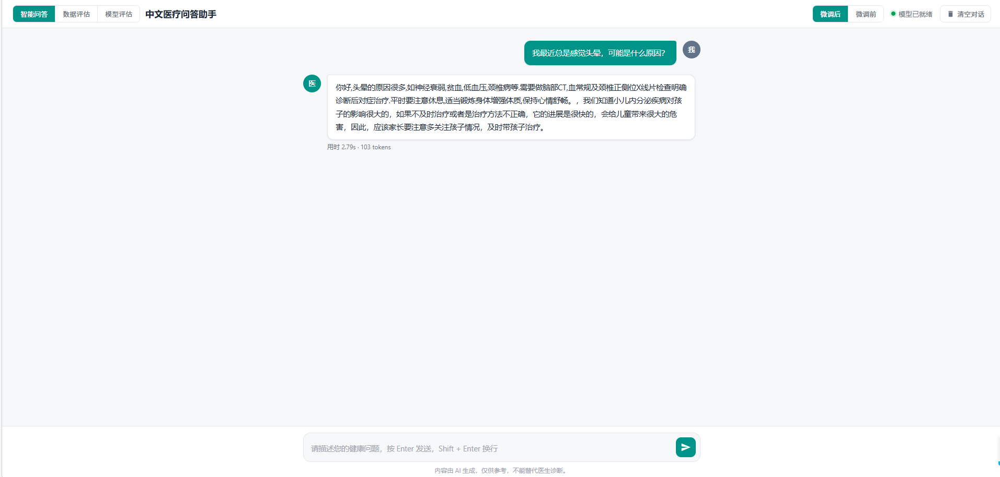
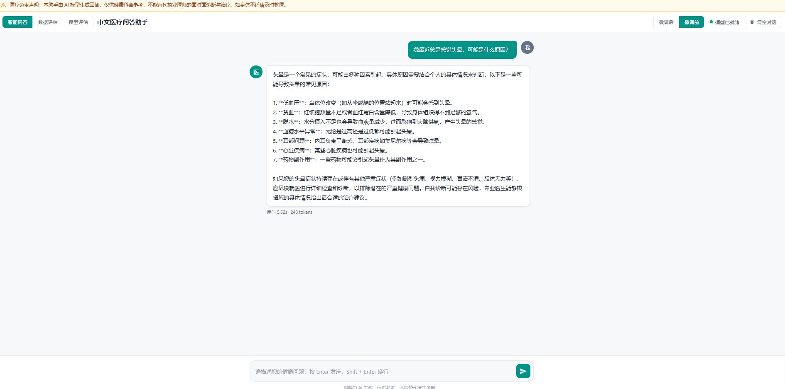
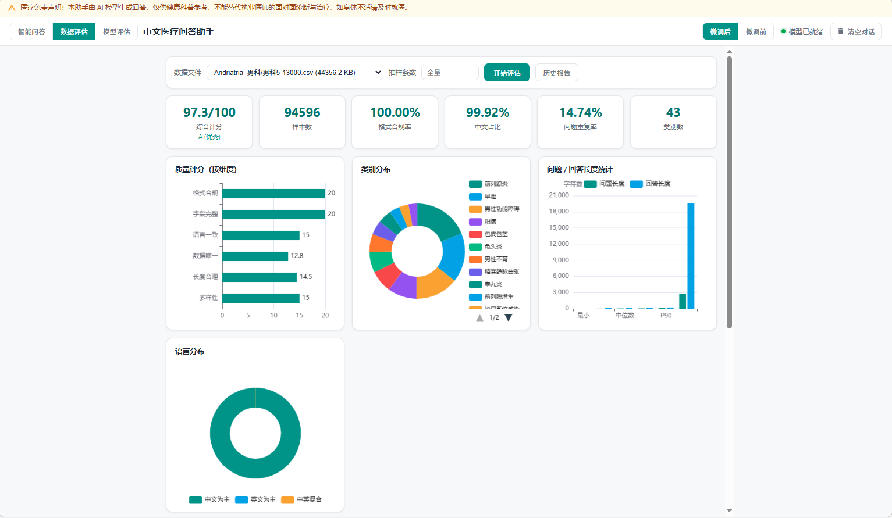
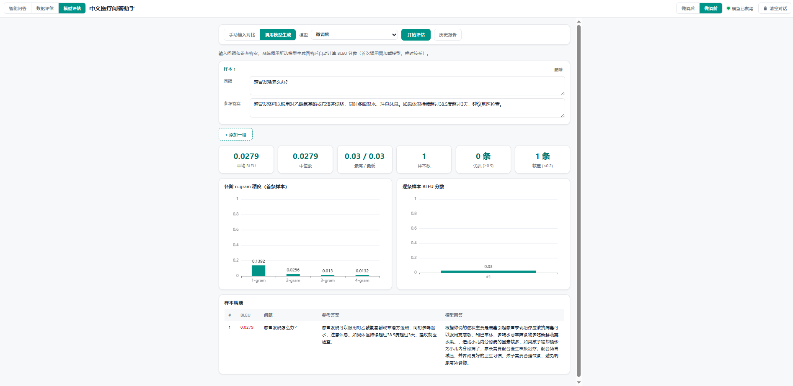
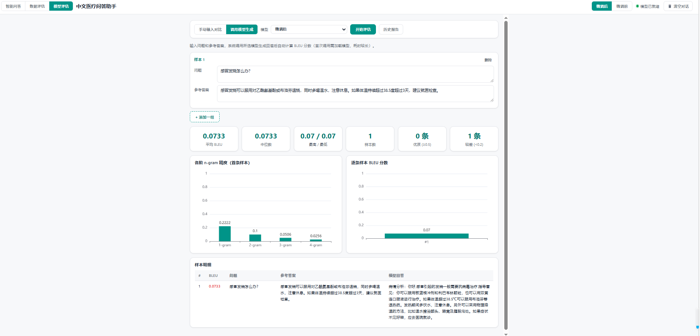

# 高效微调中文医疗问答 Chatbot 🏥

基于 **Qwen2.5-7B-Instruct** + **QLoRA 4-bit**（Unsloth + TRL SFTTrainer）的中文医疗问答 Chatbot。

> 训练：在 6 个科室（内科 / 外科 / 儿科 / 妇产科 / 男科 / 肿瘤科）各 2 万条问答（共 12 万）上做 3 epoch 微调。
> 评估：数据质量评估（`data_quality_report.py`）+ 模型 BLEU 自动评估（`bleu_evaluation.py`），均可在 Web 界面一键执行并可视化展示。
> 部署：FastAPI 推理服务 + ChatGPT 风格 Web 界面（智能问答 / 数据评估 / 模型评估三个页面），支持流式输出、计时、多轮会话、医疗免责声明。

详细方案见 [`PLAN.md`](./PLAN.md)。

---

## 目录结构

```
chineseMedicalLora/
├── 素材/                              # 既有材料（保留作参考）
│   ├── Qwen2_5_(7B)_医疗微调.ipynb
│   └── Qwen2_5_(7B)_医疗微调.py
├── datasets/                          # 中文医疗问答数据（6 科室）
├── src/                               # 核心代码
│   ├── build_dataset.py               # CSV → JSONL 数据预处理
│   ├── train.py                       # Unsloth + LoRA 训练
│   ├── merge_lora.py                  # LoRA → 合并 HF 模型
│   ├── data_quality_report.py         # 数据质量评估（多维评分 + JSON 报告）
│   ├── bleu_evaluation.py             # BLEU 自动评估（中英文分词 + 微调前后对比）
│   └── serve/
│       ├── app.py                     # FastAPI 入口（含评估 API 路由）
│       ├── inference.py               # 模型加载 + 生成（切换模型自动释放旧模型）
│       ├── evaluation_api.py          # 评估功能后端（复用上述两个评估模块）
│       └── static/                    # 前端
│           ├── index.html             # 三页面布局（问答 / 数据评估 / 模型评估）
│           ├── style.css
│           ├── app.js
│           ├── echarts.min.js         # 评估图表库（本地化，无外网依赖）
│           ├── reports/               # 历史评估报告 JSON（自动生成）
│           └── image.png              # 界面预览截图
├── scripts/                           # 一键脚本
│   ├── 01_build_data.sh
│   ├── 02_train.sh
│   ├── 03_merge.sh
│   └── 04_serve.sh
├── data/                              # 处理后数据
│   └── processed/
│       ├── train.jsonl
│       ├── val.jsonl
│       ├── _dryrun.jsonl
│       └── stats.json
├── outputs/                           # 训练产物
│   ├── lora_adapter/                  # LoRA 权重 ~100MB
│   ├── merged_model/                  # 合并后 HF 模型 ~15GB
│   └── logs/
├── images/                            # README 界面预览截图
├── PLAN.md                            # 完整方案文档
├── requirements.txt
└── .env.example
```

---

## 快速开始（4 步）

> 推荐环境：AutoDL 容器 / 任意 Linux + GPU ≥ 24GB（RTX 4090 / A5000 / A100）。CPU 可跑推理但慢。

### 0. 创建 Conda 环境 + 安装依赖

**本机已验证环境：PyTorch 2.5.1 / Python 3.11 / CUDA 12.4 / RTX 4090 24GB (Ubuntu 22.04)**

```bash
# 1) 克隆/拷贝项目到本地（AutoDL 上通常 /root/autodl-tmp/work/）
cd /root/autodl-tmp/work
# 假设项目已放在 chineseMedicalLora/ 下
cd chineseMedicalLora

# 2) 创建并激活 conda 环境（Python 3.11 对 Unsloth / bitsandbytes 兼容性最稳）
conda create -n medical-sft python=3.11 -y
conda activate medical-sft

# 3) 安装 PyTorch（必须 cu124：驱动 CUDA≤12.6 时勿装官方默认的 cu130）
pip install torch==2.5.1 torchvision==0.20.1 torchaudio==2.5.1 \
    --index-url https://download.pytorch.org/whl/cu124

# 4) 安装项目依赖（会钉死 torch，避免被 unsloth 升级）
pip install -r requirements.txt
# 若环境里已有 torchao，请卸掉（与 torch 2.5.1 不兼容）:
# pip uninstall -y torchao

# 5) 验证 GPU 可用
python -c "import torch; print('PyTorch:', torch.__version__, '| CUDA:', torch.version.cuda, '| device:', torch.cuda.get_device_name(0))"
# 预期: PyTorch: 2.5.1+cu124 | CUDA: 12.4 | device: NVIDIA GeForce RTX 4090

# 6) 配置环境变量（脚本与 Python 入口会自动加载 .env）
cp .env.example .env
# 编辑 .env，至少确认 BASE_MODEL_PATH 指向含 config.json 的基座目录
```

> **AutoDL 用户注意**：驱动常见为 CUDA 12.6（如 560.x）。务必先装 `torch==2.5.1+cu124`，再装 requirements；不要让 pip 把 torch 升到 `cu128/cu130`。若 `pip install unsloth` 仍报错，参考 §常见问题 Q7。

### 1. 构建数据集

```bash
bash scripts/01_build_data.sh
# 输出: data/processed/{train,val}.jsonl + stats.json
# 默认每科 20000 条，共 ~117600 train + ~2400 val
```

### 2. 训练（**先 dry-run 再正式**）

```bash
# (a) Dry-run：用 200 条数据跑 10 步验证流水线（~3 分钟）
bash scripts/02_train.sh --dry-run

# (b) 正式训练：方案 B - 2万/科 × 3 epoch（RTX 4090 约 6.3 小时）
bash scripts/02_train.sh

# 断点续训
bash scripts/02_train.sh --resume-from outputs/lora_adapter/checkpoint-500
```

### 3. 合并 LoRA → HF 模型

```bash
bash scripts/03_merge.sh
# 输出: outputs/merged_model/ （fp16 ~15GB）
```

### 4. 启动推理服务

```bash
bash scripts/04_serve.sh
# 访问 http://localhost:8000
# AutoDL 需用平台提供的"代理"功能或自定义端口映射（对外仅暴露 6006 端口：
#   python -m uvicorn src.serve.app:app --host 0.0.0.0 --port 6006 --workers 1
#   然后在控制台「自定义服务」打开代理地址）
```

---

## Web 界面功能

顶栏三个 Tab：**智能问答** / **数据评估** / **模型评估**。

### 界面预览

**智能问答（微调后）** —— 流式回答、多轮会话、微调前/后切换：



**智能问答（微调前）** —— 基座模型对中文医疗问答的表现，可与微调后对比：



**数据评估** —— 综合评分卡片、ECharts 图表（维度评分 / 类别分布 / 长度统计 / 语言分布）与详细指标表：



**模型评估（微调前 BLEU）** —— 调用微调前基座模型生成回答后计算 BLEU：



**模型评估（微调后 BLEU）** —— 微调后模型在同一批问题上的 BLEU 对比：



### 功能说明

### 智能问答
流式逐字输出、多轮会话、停止生成、清空对话、微调前/后模型切换（切换时自动释放旧模型，单卡只驻留一份，避免 24GB 显存 OOM）。

### 数据评估（数据质量报告）
1. 下拉选择 `datasets/` 下任意 CSV/JSON 数据文件（自动探测 utf-8 / gb18030 编码）
2. 可选「抽样条数」加速大文件评估
3. 输出：
   - 综合质量评分卡片（总分/评级、格式合规率、中文占比、重复率、类别数等）
   - ECharts 图表：六维度评分柱状图、科室类别分布饼图、问题/回答长度统计、语言分布
   - 详细指标表：字段完整性、格式问题、Token 长度估算（>512/1024/2048 分布）等
4. 评估基于 `src/data_quality_report.py` 的 10 个分析维度与 0-100 综合评分（A/B/C/D 评级）

### 模型评估（BLEU）
两种模式：
- **手动输入对比**：粘贴「参考答案 + 模型回答」文本对（可增删多组），计算 BLEU-1~4
- **调用模型生成**：只填问题和参考答案，自动调用当前推理模型（可选微调前/后）生成回答后评估，适合对比微调前后效果

输出：平均/中位/最值 BLEU 卡片、优质(≥0.5)/较差(<0.2)样本统计、n-gram 精度柱状图、逐条样本分数图、样本明细表。评估基于 `src/bleu_evaluation.py`（jieba 中文分词 + 平滑 + 简短惩罚）。

两个评估页均带「历史报告」面板：每次评估自动存档 JSON 到 `src/serve/static/reports/`，可点击回看并重新渲染图表。

---

## API 一览

| 方法 | 路径 | 说明 |
| --- | --- | --- |
| GET  | `/health` | 健康检查 + 模型可用状态 |
| POST | `/chat/stream` | SSE 流式问答（`model: merged/base`） |
| GET  | `/api/evaluate/data/files` | 列出可评估的数据文件 |
| POST | `/api/evaluate/data` | 数据质量评估 `{file_path, sample_size?}` |
| POST | `/api/evaluate/bleu` | BLEU 评估 `{pairs, use_inference, model}` |
| GET  | `/api/evaluate/history` | 历史评估报告列表 |
| GET  | `/api/evaluate/report/{filename}` | 加载指定历史报告 |

---

## 端到端验证清单

- [ ] `curl http://localhost:8000/health` → `{"status":"ok","model_loaded":true}`
- [ ] 浏览器打开首页，看到顶置免责声明 banner
- [ ] 点击"我最近总是感觉头晕"示例问题
- [ ] 流式逐字显示回答，底部显示 `⏱ X.XXs · N tokens`
- [ ] 再问"我之前问过头晕，现在还需要注意什么？"（多轮）
- [ ] 流式中途点击"停止"按钮
- [ ] 点击"清空对话"按钮
- [ ] 「数据评估」页：选择数据文件 → 开始评估 → 卡片/图表/表格正常渲染
- [ ] 「模型评估」页：手动输入对比模式填写文本对 → 评估出 BLEU 分数与图表
- [ ] 「模型评估」页：必填项留空点评估 → 红框高亮提示（本地校验）
- [ ] 「历史报告」面板可回看历史评估并重新渲染图表

---

## 关键参数（环境变量）

> 写在项目根目录 `.env` 即可；`scripts/*.sh` 与训练/合并/推理入口会自动加载。

| 变量 | 默认值 / 示例 | 说明 |
| --- | --- | --- |
| `BASE_MODEL_PATH` | `/root/autodl-tmp/models/models/Qwen--Qwen2.5-7B-Instruct/snapshots/master` | 基座模型目录（须含 `config.json`） |
| `MERGED_MODEL_PATH` | `./outputs/merged_model` | 合并后模型路径 |
| `RAW_DATA_DIR` | `./datasets` | 原始数据 |
| `PROCESSED_DATA_DIR` | `./data/processed` | 处理后 JSONL |
| `N_PER_DEPT` | `20000` | 每科采样条数 |
| `MAX_CHAR_LEN` | `600` | ask+answer 字符上限 |
| `MAX_NEW_TOKENS` | `512` | 生成最大 token 数 |
| `TEMPERATURE` | `0.7` | 采样温度 |
| `TOP_P` | `0.9` | nucleus 采样 |
| `REPETITION_PENALTY` | `1.1` | 重复惩罚 |
| `HOST` | `0.0.0.0` | 服务监听地址 |
| `PORT` | `8000` | 服务端口 |

---

## 训练超参一览

```python
MAX_SEQ_LENGTH        = 2048
LORA_R                = 16
LORA_ALPHA            = 16
LORA_DROPOUT          = 0
LORA_TARGET_MODULES   = [q,k,v,o,gate,up,down]_proj
LEARNING_RATE         = 2e-4
PER_DEVICE_BATCH      = 2
GRAD_ACCUM            = 4        # effective batch = 8
EPOCHS                = 3
OPTIM                 = adamw_8bit
PACKING               = True     # ~3× 加速
SEED                  = 3407
```

---

## 常见问题

**Q1: 显存不够怎么办？**
- 方案 A：把 `LORA_R` 降到 8（参数更少）。
- 方案 B：把 `MAX_SEQ_LENGTH` 降到 1024（数据本来就短，平均 110 token）。
- 方案 C：把 `PER_DEVICE_BATCH` 降到 1，`GRAD_ACCUM` 保持 4。
- 方案 D：用 `merged_4bit` 保存 + `load_in_4bit=True` 部署。

**Q2: AutoDL 抢不到 4090 怎么办？**
- 退到 A5000（24G），训练时间 +20%。
- 退到 T4（16G）会很慢，不推荐 12 万数据。

**Q3: 训练中断了能续吗？**
- 可以。`bash scripts/02_train.sh --resume-from outputs/lora_adapter/checkpoint-500`
- 每 500 步自动 save，保留最近 2 个 checkpoint。

**Q4: 怎么调整采样量？**
```bash
N_PER_DEPT=10000 bash scripts/01_build_data.sh   # 每科 1 万，总 6 万
N_PER_DEPT=30000 bash scripts/01_build_data.sh   # 每科 3 万，总 18 万
```

**Q5: 模型效果不理想怎么办？**
- 增大数据：把 N_PER_DEPT 调到 30000+。
- 已默认 3 epoch：`src/train.py` 中 `NUM_TRAIN_EPOCHS=3`，可按需改回 1（更快）或继续加大。
- 改超参：尝试 `LEARNING_RATE=1e-4`（更稳定）。
- 注意：本方案为"快速验证版"，非生产级。

**Q6: Web 界面打不开？**
- 检查端口：`netstat -tlnp | grep 8000`
- 检查防火墙：AutoDL 需在平台控制台开端口。
- 检查浏览器 Console：F12 看是否有 404 / 500。

**Q7: `pip install unsloth` / 训练启动报错怎么办？**
AutoDL 上常见几种情况：
```bash
# 报错 1: "No module named 'torch'"  →  conda 装好但 pip 走的不是 conda 环境
conda activate medical-sft
which pip        # 确认在 .../envs/medical-sft/bin/pip
which python

# 报错 2: "CUDA driver too old" / Unsloth cannot find any torch accelerator
#   → 装成了 torch+cu130，而驱动只到 CUDA 12.6
pip uninstall -y torch torchvision torchaudio
pip install torch==2.5.1 torchvision==0.20.1 torchaudio==2.5.1 \
    --index-url https://download.pytorch.org/whl/cu124
pip install xformers==0.0.28.post3

# 报错 3: AttributeError: module 'torch' has no attribute 'int1'
#   → torchao 过新，与 torch 2.5.1 不兼容（本项目不需要 torchao）
pip uninstall -y torchao

# 报错 4: Can't load configuration / HFValidationError on local path
#   → BASE_MODEL_PATH 未指向含 config.json 的目录；检查 .env 后重跑

# 报错 5: bitsandbytes 找不到 libcudart
export LD_LIBRARY_PATH=$CONDA_PREFIX/lib:$LD_LIBRARY_PATH
```

如果以上都解决不了，**换用 AutoDL 官方/社区训练镜像**（推荐 `PyTorch 2.5.1 + Python 3.11 + CUDA 12.4`）。

---

## 风险与注意

1. **数据来源**：本数据集来自第三方医疗问答网站，部署公网前需评估合规性。
2. **效果边界**：12 万 × 3 epoch，长尾医学问题可能答得泛。生产场景需更多数据。
3. **TRL 版本**：训练使用 `SFTConfig`（`trl` 0.12–0.24）；`assistant_only_loss` / `packing` / `dataset_num_proc` 写在 `SFTConfig` 里，不要放进旧的 `TrainingArguments`。
4. **合并后磁盘**：fp16 约 15GB，确保 AutoDL 容器数据盘 ≥ 30GB。
5. **依赖钉死**：勿升级到 `transformers` 5.x 或 `torch` cu130，除非同步升级驱动与整套栈。

---

## 致谢

- Unsloth 团队（训练加速）
- TRL / HuggingFace PEFT（SFT 框架）
- Qwen 团队（基座模型）
