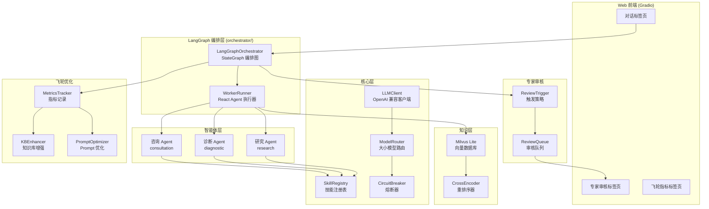
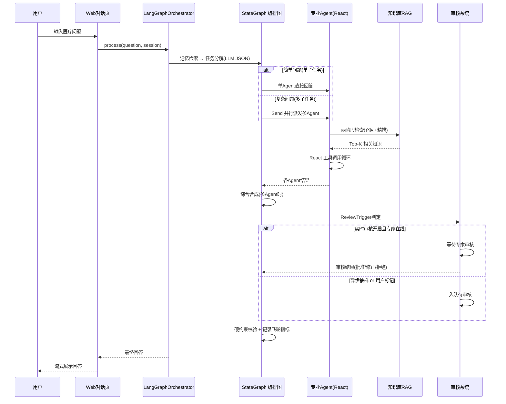
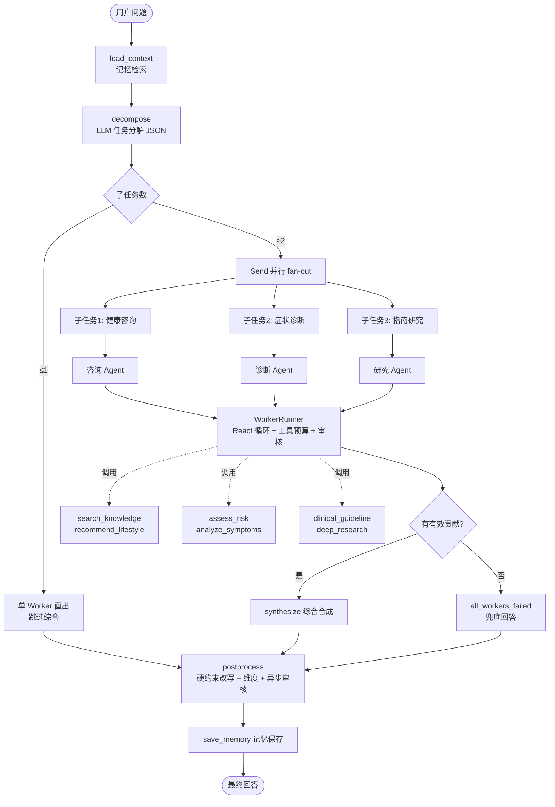
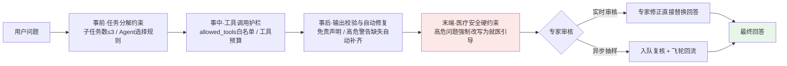

# 🏥 AI智能医疗诊断系统

多智能体协作的医疗助手，集咨询、诊断、研究为一体。基于 LangGraph 多智能体编排 + RAG 知识库检索 + 专家审核闭环 + 飞轮指标优化。

---

## ✨ 核心特性

- **多智能体协作**：咨询 / 诊断 / 研究三类 Agent，由 LangGraph 编排图自动分解任务、并行执行并汇总
- **Harness Engineering 工程护栏**：约束验证 + 输出自动修复 + 医疗安全硬约束 + 专家审核，贯穿任务分解到最终输出的全链路
- **两阶段 RAG 检索**：向量召回（bge-small-zh-v1.5）→ CrossEncoder 精排（bge-reranker-base）
- **专家审核闭环**：实时审核 / 异步抽样审核 / 用户标记纠错，支持批准、修正、拒绝
- **飞轮自我优化**：记录查询、审核、修正指标，驱动知识库增强与 Prompt 优化
- **长期记忆**：Mem0 + Redis 短期记忆，支持上下文连续对话
- **质量评估体系**：RAG / Agent / Swarm / 性能 四维评估，支持 LLM-as-Judge

---

## 🏗️ 系统架构



---

## 🔄 问答处理流程



---

## 🔍 RAG 两阶段检索


检索开启两阶段时，先扩大向量召回候选池保召回率，再经 CrossEncoder 交叉注意力精排提升精度。

---

## 🤖 LangGraph 多智能体编排



---

## 🛡️ Harness Engineering 工程护栏

Harness Engineering 指在 LLM 外围构建**确定性的工程护栏**：用规则验证约束模型行为、自动修复违规输出、硬约束兜底安全底线——不依赖模型"自觉"，而是把医疗安全要求工程化地贯穿到任务分解、工具调用、输出生成、最终交付的每一环。



### 全链路护栏清单

| 阶段 | 机制 | 实现 | 行为 |
|------|------|------|------|
| 事前 | 任务分解约束 | `constraints/swarm_constraints.yaml` + `validator.validate_task_decomposition()` | 子任务数超过上限自动裁剪；高风险症状问题未分配诊断 Agent 时告警 |
| 事前 | 工具调用约束 | `constraints/agent_constraints.yaml` + `validator.validate_tool_call()` | 每个 Agent 的 `allowed_tools` 白名单，越权调用记录告警 |
| 事中 | 资源预算 | `orchestrator/tools.py` ToolCallBudget + WorkerRunner 递归上限 | 单次运行工具调用 ≤2 次（超限引导作答）、递归上限兜底、Worker 75s / 全图 120s 超时 |
| 事后 | 输出校验 + 自动修复 | `validator.validate_output()` + `validation/auto_fixer.py` | 缺免责声明自动补齐、高危症状自动加就医提醒（可修复项自动修，不可修复项告警） |
| 末端 | 医疗安全硬约束 | `constraints/emergency.py`（16 个高危关键词） | 胸痛/昏迷/休克等急症问题，回答未含就医引导时**强制改写**为标准就医话术，原文保留在 `reference_answer` 字段 |
| 人在环路 | 专家审核 | `review/`（实时阻塞 + 异步抽样） | 高危/强制停止的回答阻塞等待专家修正（修正直接替换答案），常规回答按比例抽样入队复核 |

### 设计原则

- **验证不阻断、硬约束才阻断**：常规约束（白名单/输出格式）以告警和自动修复为主，保证可用性；仅医疗急症硬约束采取强制改写，守住安全底线
- **护栏可配置**：全部约束规则在 `constraints/*.yaml` 声明式维护，无需改代码即可调整关键词、白名单和阈值
- **修复留痕**：硬约束改写保留原始回答（`reference_answer`）、专家修正记录审核编号，所有干预可追溯

---

## 🚀 快速开始

### 方式一：本地运行

```bash
# 1. 安装依赖（清华镜像加速）
pip install -r requirements.txt -i https://pypi.tuna.tsinghua.edu.cn/simple

# 2. 配置环境变量
cp .env.example .env
# 编辑 .env，填入 LLM_API_KEY

# 3. 初始化知识库（首次运行，自动下载嵌入模型）
python -m knowledge.scripts.import_hardcoded_data

# 4. 启动 Web 服务
python main.py
```

访问 http://localhost:7860

### 方式二：Docker 部署（推荐，全量中国镜像）

```bash
# 构建并启动（知识库会自动初始化）
docker compose up -d

# 查看日志
docker compose logs -f

# 停止
docker compose down
```

Docker 构建全程使用国内镜像：DaoCloud 基础镜像、清华 apt、清华 pip、hf-mirror 模型下载。

---

## 📂 目录结构

```
medicalAgent/
├── main.py                 # 入口（Web 默认 / --cli 命令行）
├── requirements.txt        # 依赖
├── Dockerfile              # 容器构建
├── docker-compose.yml      # 编排启动
├── docker-entrypoint.sh    # 启动脚本（自动初始化知识库）
├── .env                    # 环境配置（含密钥，不提交）
├── agents/                 # 专业 Agent（咨询/诊断/研究）
├── orchestrator/           # LangGraph 多智能体编排（编排图/WorkerRunner/工厂）
├── core/                   # 核心：LLM 客户端、技能、状态、熔断、路由
├── knowledge/              # 知识库：Milvus Lite + 重排序器
│   ├── data/documents/     # 医疗文档源
│   └── scripts/            # 文档导入脚本
├── review/                 # 专家审核：队列、触发、接口
├── flywheel/               # 飞轮：指标、知识库增强、Prompt 优化
├── memory/                 # 记忆：短期、长期、会话摘要
├── research/               # 深度研究工作流
├── constraints/            # Agent 约束校验（YAML）
├── validation/             # 输出自动修复
├── evaluation/             # 评估：RAG/Agent/Swarm/性能
├── scripts/                # 辅助脚本（端到端冒烟）
└── web/                    # Gradio Web 界面
```

---

## ⚙️ 关键配置

| 配置项 | 默认值 | 说明 |
|---|---|---|
| `LLM_API_KEY` | - | LLM API Key（必填） |
| `LLM_MODEL_NAME` | qwen-plus | 主模型 |
| `KB_TOP_K` | 5 | 检索返回条数 |
| `RERANK_ENABLED` | false | 是否开启两阶段重排 |
| `RERANK_CANDIDATE_K` | 15 | 重排候选池大小 |
| `REVIEW_ENABLED` | true | 是否开启专家审核 |
| `REVIEW_REALTIME_ENABLED` | false | 实时审核（否则异步抽样） |
| `REVIEW_ASYNC_SAMPLE_RATE` | 0.05 | 异步抽样审核比例 |

完整配置见 `.env.example`。

---

## 📊 质量评估

```bash
# 全部维度
python -m evaluation.run_eval

# 单维度
python -m evaluation.run_eval -d rag        # RAG 检索质量
python -m evaluation.run_eval -d agent      # Agent 能力
python -m evaluation.run_eval -d swarm      # 协作质量
python -m evaluation.run_eval -d performance # 性能延迟
```

评估报告自动按时间戳保存到 `evaluation/data/reports/eval_report_YYYYMMDD_HHMMSS.json`。

> 注意：评估需访问 Milvus 知识库，运行评估前请先停止 Web 服务（Milvus Lite 为单进程文件锁）。

---

## 🔒 免责声明

本系统提供的信息仅供参考，不能替代专业医生的诊断。如有健康问题，请咨询专业医生。
